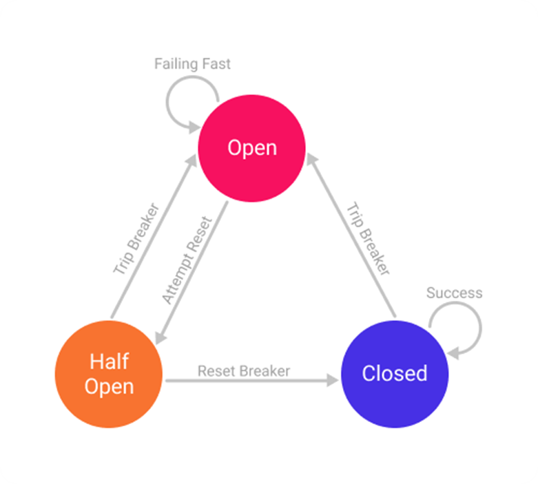

# 8. Resilience4j - Circuit breaker mechanism.

This Spring Boot application demonstrates how to use Resilience4j for resilience and fault tolerance in microservices
architecture.

## Overview

The application consists of a `UserController` class that uses Resilience4j's `@CircuitBreaker` annotation to handle
failures when calling a remote service to retrieve user orders. The `UserController` class also includes a fallback method
to provide default orders when the circuit is open.

See below diagram for understanding the Circuit Breaker States
 

## Configuration

### Management Configuration

| Key                                       | Type    | Description                                                                                                                                   | Default Value / Example                                   |
|-------------------------------------------|---------|-----------------------------------------------------------------------------------------------------------------------------------------------|-----------------------------------------------------------|
| management.health.circuitbreakers.enabled | Boolean | To enable or disable the health indicator for circuit breakers in Spring Boot Actuator.                                                       | true                                                      | 
| management.endpoints.web.exposure.include | String  | To expose specific endpoints in Spring Boot Actuator, including the circuit breaker status endpoint.                                          | ex: health,circuitbreakers                                |
| management.endpoint.health.showDetails    | String  | To control whether the health endpoint in Spring Boot Actuator should include additional details, such as component details and dependencies. | Possible values: never, when_authorized (Default), always |

### Resilience4j Configuration :

All config key prefixed with `resilience4j.circuitbreaker.instances`

| Key                                                                 | Type    | Description                                                                                                                                                                                  | Default Value / Example                                                                                                                                                                        |
|---------------------------------------------------------------------|---------|----------------------------------------------------------------------------------------------------------------------------------------------------------------------------------------------|------------------------------------------------------------------------------------------------------------------------------------------------------------------------------------------------|
| [prefix].[serviceName].automaticTransitionFromOpenToHalfOpenEnabled | Boolean | Controls whether the circuit breaker automatically transitions from the open to the half-open state after the `waitDurationInOpenState` has elapsed.                                         | false                                                                                                                                                                                          |
| [prefix].[serviceName].eventConsumerBufferSize                      | Number  | To configure the size of the ring buffer used by the circuit breaker to track events. This buffer is used to record the outcomes of calls (successes, failures, etc.).                       | 100                                                                                                                                                                                            |
| [prefix].[serviceName].failureRateThreshold                         | Number  | Specifies the threshold percentage for the failure rate at which the circuit breaker should open.                                                                                            | ex: 50, indicating that if more than 50% of calls to the protected resource fail, the circuit breaker will open.                                                                               |
| [prefix].[serviceName].minimumNumberOfCalls                         | Number  | Specifies the minimum number of calls that must be made to the protected resource before the circuit breaker can calculate the failure rate and decide whether to open or close the circuit. | ex: 10, indicating that at least 10 calls must be made to the protected resource before the circuit breaker can make a decision.                                                               |
| [prefix].[serviceName].permittedNumberOfCallsInHalfOpenState        | Number  | Specifies the maximum number of calls that are permitted in the half-open state.                                                                                                             | ex: 3,  indicating that only 3 calls are permitted in the half-open state.                                                                                                                     |
| [prefix].[serviceName].registerHealthIndicator                      | Boolean | Determines whether a health indicator bean should be registered with the Spring ApplicationContext                                                                                           | ex: true, indicating that the health indicator bean should be registered. This allows you to monitor the status of the circuit breaker using Spring Boot Actuator's /actuator/health endpoint. |
| [prefix].[serviceName].slidingWindowSize                            | Number  | Defines the number of function calls that are considered for calculating the error rate and determining if the circuit breaker should open or close.                                         | ex: 10, meaning that the circuit breaker will consider the outcomes of the last 10 function calls when calculating the error rate.                                                             |
| [prefix].[serviceName].slidingWindowType                            | String  | Type of sliding window used for tracking function call outcomes.                                                                                                                             | Possible values: COUNT_BASED or TIME_BASED.                                                                                                                                                    |
| [prefix].[serviceName].waitDurationInOpenState                      | String  | Specifies the duration for which the circuit breaker should stay in the open state before transitioning to the half-open state.                                                              | ex: 5s, indicating that the circuit breaker will stay open for 5 seconds before transitioning to the half-open state.                                                                          |

## Usage

- Access the application at http://localhost:1111/user/orders to retrieve user orders.
- Simulate failures by stopping the remote service or causing it to return errors, and observe how Resilience4j handles the failures.

## How to Run

To run this project locally, you need to have **Java** and **Maven** installed on your machine.

1. Clone the repository
2. Navigate to the project directory
3. Update the configurations in `application.properties` file.
4. Requires [Order Service](../OrderService/README.md) as a remote service to test resilience.
5. Run `mvn spring-boot:run` to start the application.
6. Access the application at http://localhost:1111/user/orders to retrieve user orders.

## Dependencies

- Spring Boot
- Spring Boot Web
- Spring Boot AOP
- Spring Boot Actuator
- Resilience4j spring-boot3: Version: 2.1.0

## Author

- Harsimar Kaur (https://github.com/simarkaur12).